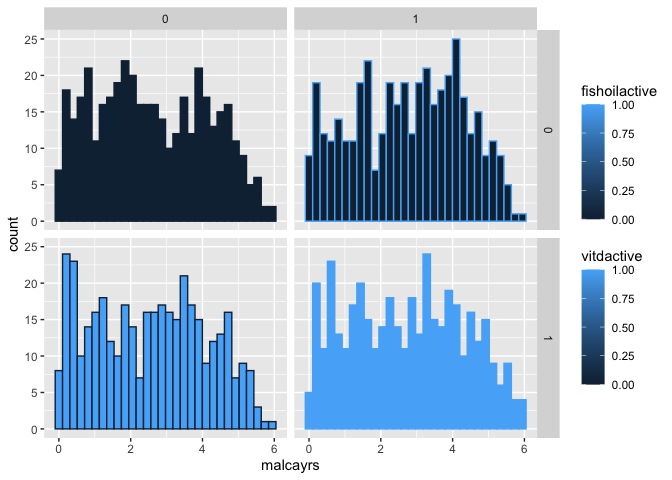

<!-- README.md is generated from README.Rmd. Please edit that file -->

# bis620.2022

<!-- badges: start -->

[](https://github.com/celestinebj23/bis620.2022/actions/workflows/R-CMD-check.yaml)
[](https://github.com/celestinebj23/bis620.2022/actions/workflows/test-coverage.yaml)
[](https://github.com/celestinebj23/bis620.2022/actions/workflows/lint.yaml)
[](https://codecov.io/gh/celestinebj23/bis620.2022)
<!-- badges: end --> bis620.2022 is a package to examine how would the
supplements of Vitamin D or Omega-3 affect the person-year of various
types of cancers and cardiovascular, for which person-year is defined as
the estimate of the actual time at risk. Additionally, how factors such
as BMI and smoking would act in the given experimental trials are also
considered.

Refer to the example data `vital` for more details.

### Badge overview

[Test Coverage
page](https://github.com/celestinebj23/bis620.2022/actions/workflows/test-coverage.yaml)

[Lint
results](https://github.com/celestinebj23/bis620.2022/actions/workflows/lint.yaml)

## Installation

You can install the development version of bis620.2022 from
[GitHub](https://github.com/celestinebj23/bis620.2022) with:

``` r
# install.packages("devtools")
devtools::install_github("celestinebj23/bis620.2022")
```

## Example

This is a basic example which shows you how to solve a common problem:

``` r
library(bis620.2022)
library(dplyr)
#> 
#> Attaching package: 'dplyr'
#> The following objects are masked from 'package:stats':
#> 
#>     filter, lag
#> The following objects are masked from 'package:base':
#> 
#>     intersect, setdiff, setequal, union
library(ggplot2)
library(ggpubr)
# call of vital data
data(vital)
# plots the histogram of the time at risk of four groups, taking breast cancer as an example
vital_hist(vital, "brca")
```



``` r
# plot the scatter plot of the time at risk versus bmi for four groups with the effect of smoking and model with linear regression with linear line and equation shown, taking breast cancer as an example
vital_model_smoke(vital, "brca")
#> Warning: The dot-dot notation (`..rr.label..`) was deprecated in ggplot2 3.4.0.
#> ℹ Please use `after_stat(rr.label)` instead.
#> ℹ The deprecated feature was likely used in the bis620.2022 package.
#>   Please report the issue to the authors.
#> `geom_smooth()` using formula = 'y ~ x'
#> Warning: Removed 960 rows containing non-finite values (`stat_smooth()`).
#> Warning: Removed 960 rows containing non-finite values
#> (`stat_regline_equation()`).
#> Warning: Removed 960 rows containing non-finite values (`stat_cor()`).
#> Warning: Removed 960 rows containing missing values (`geom_point()`).
```


``` r
# this is for without effect of smoking
vital_model_nosmoke(vital, "brca")
#> `geom_smooth()` using formula = 'y ~ x'
#> Warning: Removed 11956 rows containing non-finite values (`stat_smooth()`).
#> Warning: Removed 11956 rows containing non-finite values
#> (`stat_regline_equation()`).
#> Warning: Removed 11956 rows containing non-finite values (`stat_cor()`).
#> Warning: Removed 11956 rows containing missing values (`geom_point()`).
```


